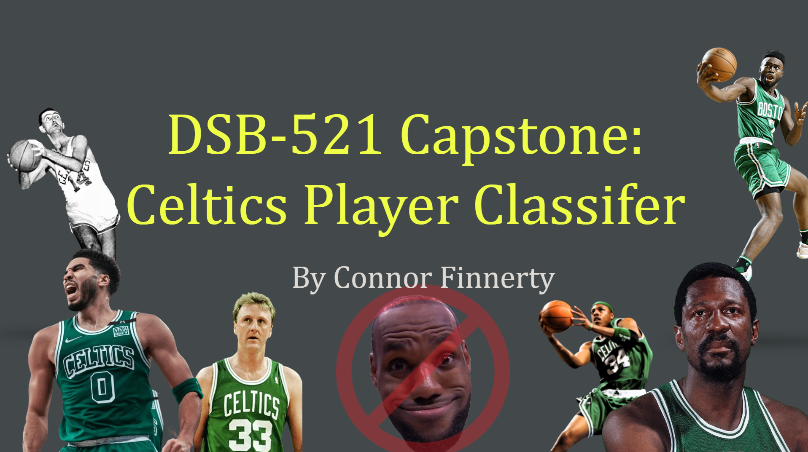
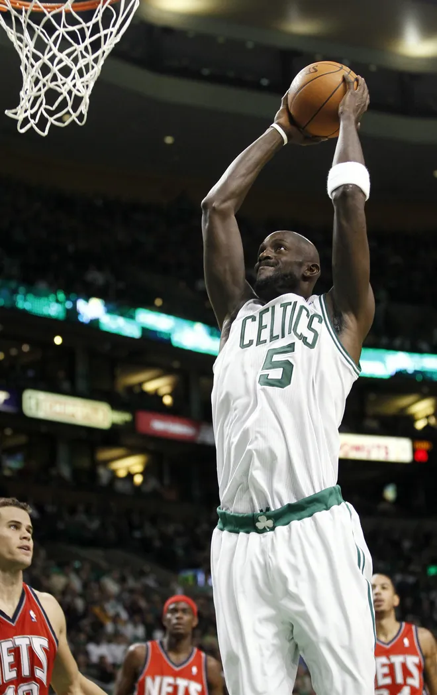
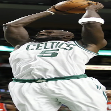
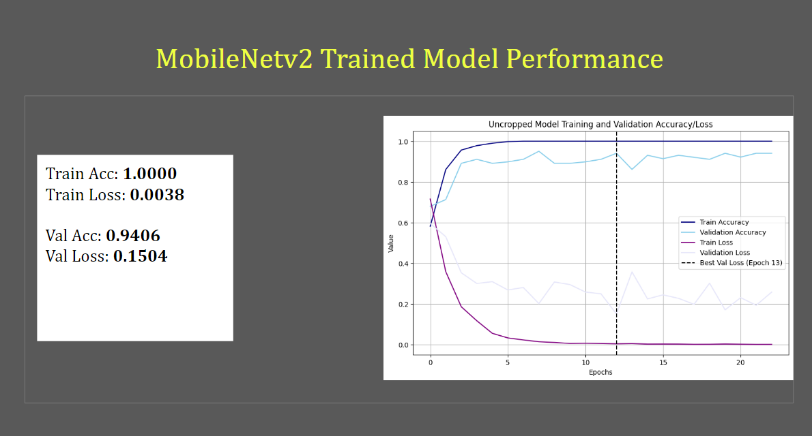
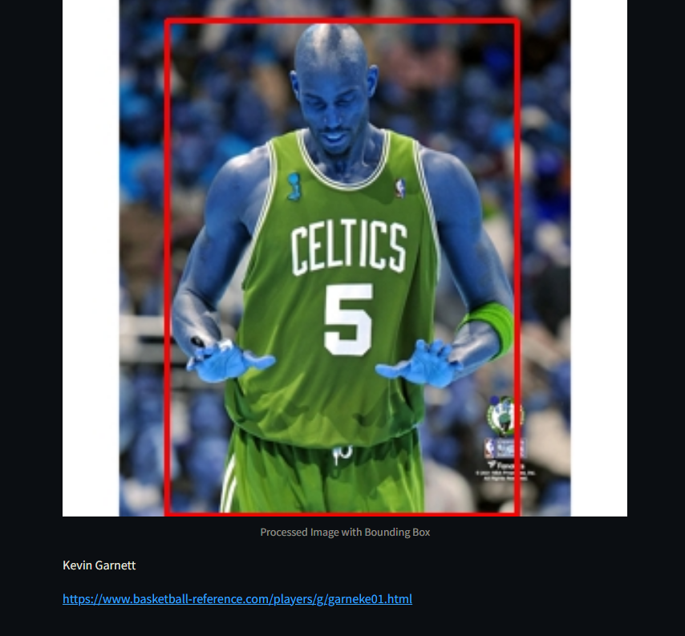
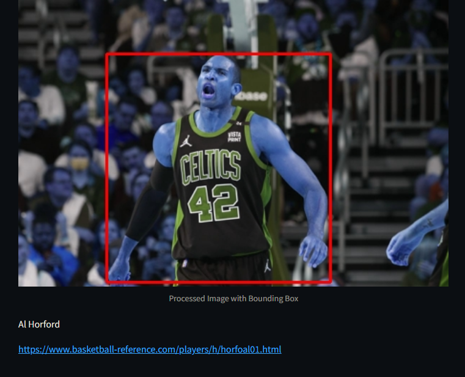
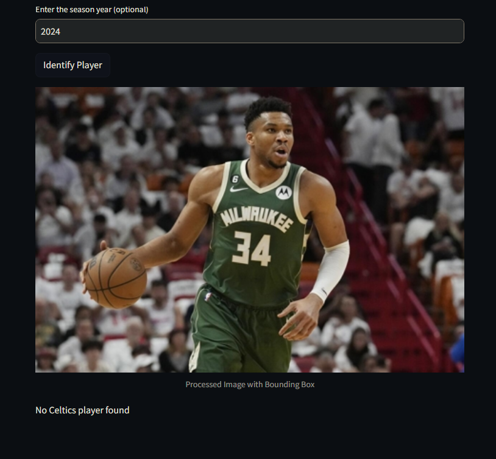
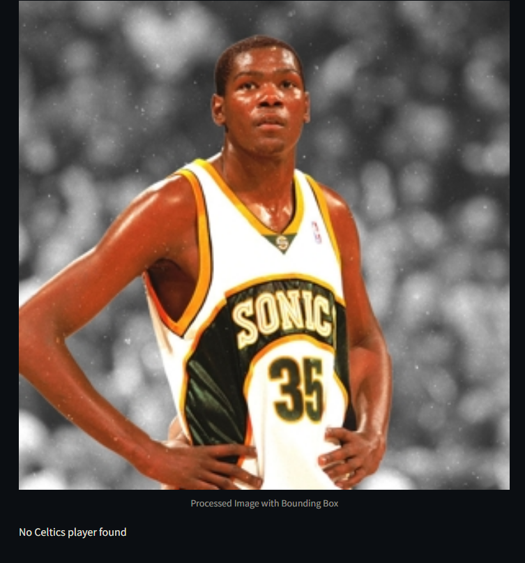

# Celtics Player Visual Identifier

  

**By Connor Finnerty**

## Purpose

My goal for this project was to develop a visual identifier for members of the NBA team, the Boston Celtics, capable of distinguishing Celtics players from players of other NBA teams. Additionally, my application is also able to use a visually apparent jersey number (clear and unobstructed) to specifically identify which player is depicted in the image, and produce their name and Basketball Reference player page.

## Methodology

To start out, I gathered thousands of images of Celtics players and non-Celtics NBA players and curated which ones would work best for training a machine vision CNN classifier. Then, I checked which images were capable of being processed by a TensorFlow Keras model. Following that, I used YOLO (You Only Look Once), a SOTA (State-of-the-art) image detection model, to identify persons in the image and produce a cropped image containing only the most salient person identified.

After this first process was concluded, this left me with 667 uncropped images and 596 cropped images. It was at this point I leveraged GoogleAI’s MobileNetv2 pre-trained machine vision model, in addition to some finishing touches of my own, to train a model first on the uncropped images (to make sure the model is not overfit and is capable of generalizing to a “natural” NBA environment), and then on the cropped images of individual NBA players (to help the model to better learn to focus its classification on the players in specific). I manually cleaned images from the YOLO output to make sure misidentified persons were not included in my imageset.

After this process was completed, I saved my model and tested it to confirm that it performed classification correctly. Once this confirmation was made, I started to build my StreamLit app. The process for the StreamLit app was as follows:

1. Install necessary packages in Colab
2. Create public hosting domain using ngrok
3. When StreamLit app starts, ask user to input year for the image
4. Bring in YOLOv8 to crop player from surrounding image (based on proximity to center, sharpness, and whether they’re in the “person” category)
5. Run model on cropped image
6. If classified as non-Celtic, output that info and stop
7. If classified as Celtic, use easyOCR to scan for digits in the image. Concatenate all digits, use this number to cross-reference against roster data for input year
8. If matching roster data is found, output the name and basketball reference page for identified player
9. If matching roster data cannot be found, output that the player was identified as a Celtic, but that no roster match could be made
10. Output the image showing which player was cropped by YOLO, and show the bounding box overlaid on the original image

## Results

The image classifier performed quite well despite having very little raw data (667 images) with which to train and learn. The player-team classifier performed well, with a train accuracy and train loss of 1.000 and 0.00038, and with a validation accuracy and validation loss of .9406 and .1504. In informal testing on novel images not included in the training/validation set, the model performance seemed to match these metrics, correctly classifying images from both classes with ~.95 precision and recall.

---

How YOLO cropped images

Uncropped

Cropped

---

MobileNetv2 Classifier performance and metrics

---

Examples of StreamLit App performance

Kevin Garnett (Boston Celtics)

---

Al Horford (Boston Celtics)

---

Giannis Antetokounmpo 

---

Kevin Durant (Seattle Supersonics, 2008)

---

A drawback to easyOCR was that, without training, the pre-trained model fails to distinguish 0s from the letter “O”, defaulting to considering both aforementioned instances to be detections of the letter “O”. Additionally, easyOCR can sometimes struggle with novel fonts, and has difficulty identifying numbers that are partially obstructed or obscured.

## Conclusions

My objective for this project was to see if I could leverage several different pre-trained models to work in concert with each other to compensate for a lack of available image data to create a functional model that still performed a useful function with high accuracy/precision. I was able to achieve this through leveraging several pre-trained models that helped to augment the limited information contained in the imageset (YOLO for fine-tuning, easyOCR for extracting text data) as well as scraping publicly available web data (BeautifulSoup, Basketball reference).

This project was a pretty significant undertaking, especially since there were no publicly available datasets tailored to the problem I was trying to tackle. In the future, I would make more of an effort to train each of these models to perform more effectively on the data my model was tailored to (training YOLO to identify players of interest and distinguish them from fans/referees/broadcasters/bench players/coaches, training easyOCR to identify numbers of novel fonts and to distinguish them from alpha characters, bringing in ChronoNet or making my own Temporal Image Analysis CNN). However, for the purposes of this project, my method worked quite well, and I am satisfied with the outcome.

## Citations

| Data            | Source                                                         | Description                                                                                  |
|-----------------|----------------------------------------------------------------|----------------------------------------------------------------------------------------------|
| YOLOv8          | [Ultralytics Documentation](https://docs.ultralytics.com/)     | A state-of-the-art object detection model designed to detect objects in images and videos.   |
| MobileNetv2     | [MobileNetV2 PyTorch](https://github.com/d-li14/mobilenetv2.pytorch) | A lightweight convolutional neural network designed for mobile and edge devices, used for image classification. |
| EasyOCR         | [EasyOCR](https://github.com/JaidedAI/EasyOCR)                 | A ready-to-use OCR model that can read texts in various languages and scripts from images.   |
| ChronoNet       | [ChronoNet](https://github.com/sjeblee/chrononet)              | A temporal convolutional neural network for time-series prediction and analysis.             |
| Streamlit       | [Streamlit](https://github.com/streamlit)                      | An open-source framework used to build web apps for machine learning and data science projects. |
